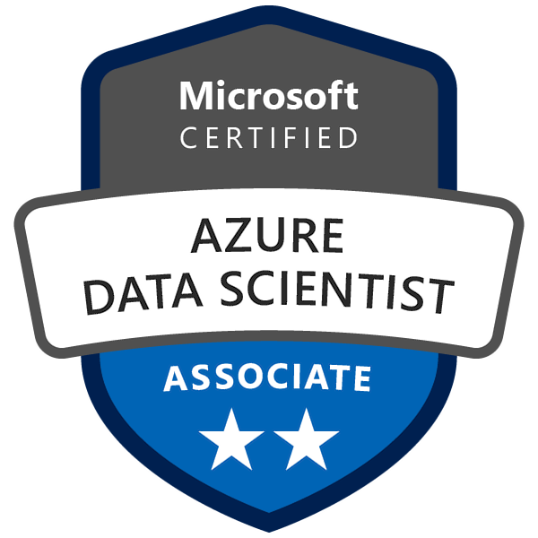

### Hi there 👋

<!--
**eparamasari/eparamasari** is a ✨ _special_ ✨ repository because its `README.md` (this file) appears on your GitHub profile.

Here are some ideas to get you started:
- 🔭 I’m currently working on ...
- 🌱 I’m currently learning ...
- 👯 I’m looking to collaborate on ...
- 🤔 I’m looking for help with ...
- 💬 Ask me about ...
- 📫 How to reach me: ...
- 😄 Pronouns: ...
- ⚡ Fun fact: ...
-->

I'm a certified data scientist and machine learning engineer with three years of experience in data science and an interdisciplinary educational background in renewable energy and environmental engineering.

💡 Current interests: climate change mitigation and adaptation research, environmental intelligence, renewable energy, and sustainability-related AI and data science projects

🌱 As a lifelong learner with a growth mindset, I seek opportunities to continuously learn new skills. Realizing the rising importance of big data in getting insights, telling stories, and finding solutions for the world's problems, I continue to learn various things related to data science, machine learning, and artificial intelligence to explore how they can be leveraged for social good and sustainability enhancements. I also enjoy learning about other topics, from design thinking to innovation management. 
I currently hold several certifications:
- CompTIA DataX
- PCAP - Certified Associate Python Programmer
- Google Cloud Professional Machine Learning Engineer Certificate
- Microsoft Certified: Azure Data Scientist, Power BI Data Analyst, Azure Data Engineer, Azure AI Engineer, and Fabric Analytics Engineer Associate
- IBM Data Science Professional Certificate
- AWS Certified Developer and Solutions Architect - Associate
- Alibaba Cloud Certified Professional (ACP)
- LFCA: Linux Foundation Certified IT Associate
- KCNA: Kubernetes and Cloud Native Associate

💻 Tech Stack:

- Data science/analytics/visualization: Python, R, PySpark, Power BI, Tableau
- Machine learning: scikit-learn, Tensorflow, PyTorch
- Generative AI: OpenAI, Huggingface
- Databases: PostgreSQL, MongoDB
- Cloud computing: Microsoft Azure, Google Cloud, AWS, Alibaba Cloud
- Others: git and GitHub, PowerShell, bash

🔭 I also have six years of experience in a managerial position at a multinational company, where I worked with 30 departments in four different countries, reduced costs in our environmental projects by 60%, and initiated 15+ new programs; and a few years in sustainability consulting, working mostly in impact assessment and environmental data analysis.

✨ I’m looking to collaborate on AI for good projects and hackathons.

⚡ When not at work, I travel with my family, learn new languages, read, write rap songs, or play basketball.
  I also enjoy participating in data science hackathons with my fellow ladies at AI Wonder Girls.

📫 How to reach me: [LinkedIn](https://www.linkedin.com/in/ernitia-paramasari/) 

